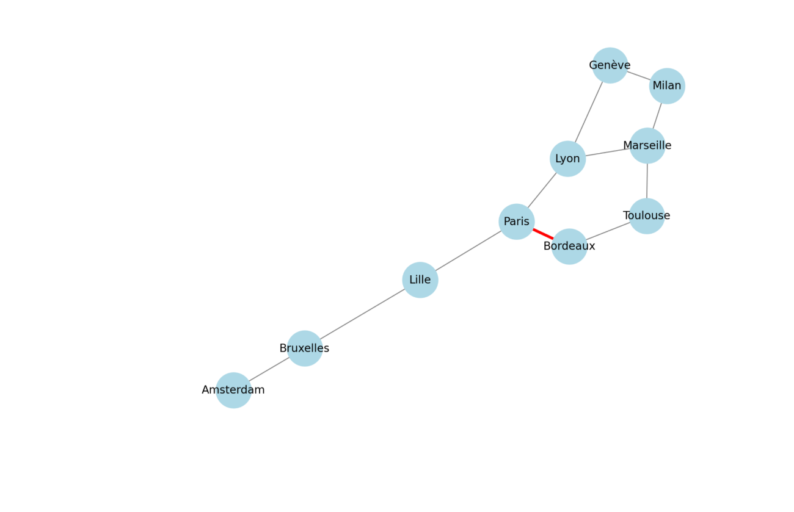
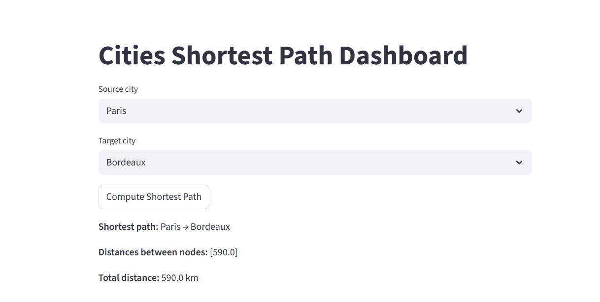

# Projet  — Cities Graph

## Contexte
Ce projet consiste à analyser les connexions entre différentes villes à partir d'un fichier CSV contenant les distances entre elles. L'objectif est de représenter ces villes sous forme de graphe, d'explorer les connexions et de visualiser certaines analyses via une interface web.

## Sources de données
Le fichier CSV utilisé (`cities.csv`) 

## Technologies utilisées
- **Python** : pour le traitement et l'import des données.  
- **Neo4j** : base de données graphe pour stocker les villes et leurs connexions.  
- **Streamlit** : interface web pour visualiser les résultats.  
- **pandas** : lecture et manipulation des CSV.  
- **dotenv** : gestion des variables d'environnement (identifiants Neo4j).  

## Structure du projet
```

projet2/
├─ src/
│  ├─ import.py        # Script pour importer les données CSV dans Neo4j
│  ├─ shortest_path.py # Interface Streamlit pour rechercher le plus court chemin
├─ cities.csv           # Données sources
├─ .env                 # Variables d'environnement Neo4j
├─ README.md            # Ce fichier

```

## Import des données dans Neo4j
Le script `import.py` :  
1. Crée un **noeud `City`** pour chaque ville.  
2. Crée une **relation `CONNECTED`** entre les villes avec la distance comme propriété.  
3. Assure que les villes ne sont pas dupliquées et que les connexions sont bidirectionnelles.  

## Visualisation avec Streamlit

Le script `shortest_path.py` permet de :

* Choisir une ville de départ et une ville d’arrivée.
* Afficher le **chemin le plus court** et la distance totale (calculé directement via Neo4j, GDS non utilisé ici).

Pour lancer l'interface :

```bash
streamlit run src/shortest_path.py
```
### 1. Requêtes sur Neo4j


### 2. Tableau de bord Streamlit - Accueil




## Conclusion

Ce projet montre comment :

* Importer et transformer des données CSV dans une base graphe Neo4j.
* Explorer les connexions entre villes.
* Créer une interface web simple pour visualiser les résultats.