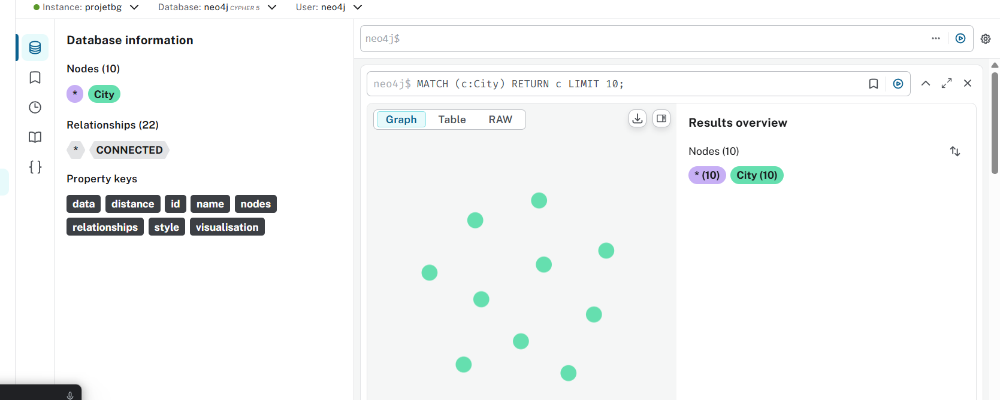

# Projet 2 : Chemin le plus court entre villes avec Neo4j

## Description
Ce projet utilise Neo4j pour modéliser un réseau de villes avec leurs distances et calculer le chemin le plus court entre deux villes.  
Une interface **Streamlit** permet d'entrer deux villes et d'afficher le chemin optimal.

## Fonctionnalités
- Import des données CSV dans Neo4j.
- Calcul du chemin le plus court entre deux villes.
- Interface Streamlit pour visualiser le résultat.

## Prérequis
- Python 3.9+
- Neo4j Desktop (ou Neo4j Aura)
- Pip

## Installation

1. Cloner le projet
```bash
git clone <TON_REPO_URL>
cd projet2
'''
## Captures d'écran

### 1. Requête plus court chemin


### 2. Résultat du plus court chemin


### 3. Tableau de bord Streamlit - Accueil


### 4. Création du modèle ML


